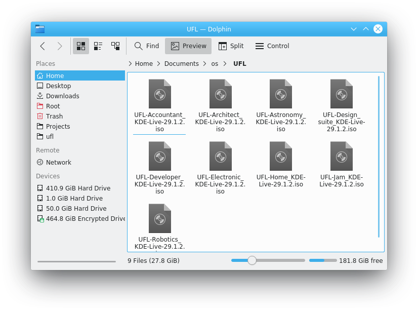

# UFL - Unofficial Fedora Labs 29.1.2

## All variant use KDE Desktop

The computer on which you intend to install Majapahit 29 from the live CD should have:

- a DVD or USB drive (minimum 4Gib), and the capability to boot from this drive.
- a 1 GHz processor or faster
- at least 2 GB of memory (RAM)

## Featured

- RPMFusion
- Included Codec
- KDE Apps
- add Developer Edition
- add Accountant Edition
- add Electronic Edition

## Build

## File

- UFL-Accountant_KDE-Live-29.1.2.iso
- UFL-Architect_KDE-Live-29.1.2.iso
- UFL-Astronomy_KDE-Live-29.1.2.iso
- UFL-Design_suite_KDE-Live-29.1.2.iso
- UFL-Developer_KDE-Live-29.1.2.iso
- UFL-Electronic_KDE-Live-29.1.2.iso
- UFL-Home_KDE-Live-29.1.2.iso
- UFL-Jam_KDE-Live-29.1.2.iso
- UFL-Robotics_KDE-Live-29.1.2.iso
- UFL-Scientific-Live-29.1.2.iso
- UFL-Security-Live-29.1.2.iso
